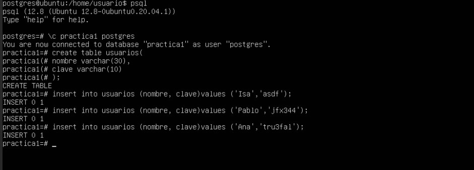

# Introducción PostgreSQL

En la práctica se nos pide instalar el SGDB postgresql y crear una base de datos de prueba. La entrega corresponderá al histórico de comandos ejecutados hasta concluir la tarea. Estos deben estar en el repositorio GitHub de la asignatura.

Para la realización del ejercicio, dberemos acceder a la máquina virtual que se nos a asignado para la realización de las prácticas de la asignatura. El objetivo principal de la práctica es instalar el SGBD postgresql.

-----------------------------------------------------------------------------------------------------------------------------------------------------------------------------------

En primer lugar comenzamos con los comandos de instalacion: 

  * sudo apt-get install postgresql

A continuacion, depues de realizar la instalacion, deberemos acceder con el superusuario de postgre y crear un usuario con los siguientes comandos:

  * sudo su postgres password: XXXXXXXXXX
 
 IMAGEN SUDO 
 
 Para entrar en la línea de comandos de postgre y así poder crear " mi usuario", deberemos escribir " psql " y ya dentro escribir lo siguiente: 
 
  * createuser miusuario
  * alter role miusuario with password 'mipassword';
 
 
 IMAGEN MIUSUARIO
 
 Para terminar con la parte de introduccion, se ralizo la prueba de algunos de los comandos mas basicos de postgre: 
 
 IMAGEN COMANDOS
 
 
 Pasando a la segunda parte de la practica, pasamos a crear la tabla que se nos ha pedido en el enunciado:
 
  * Priemro Creamos la tabla

  * En segundo lugar realizamos los insert

  * Mostramos la tabla resultante
 
 
 

